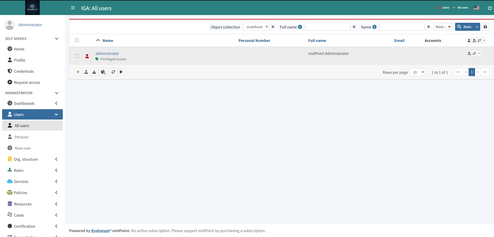
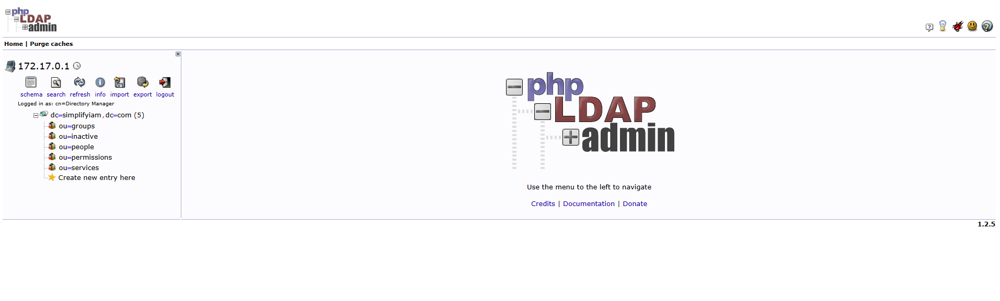

# SimplifyIAM IAM Implementation Portfolio
**Cohort:** SimplifyIAM Live Cohort 1 &ensp;&ensp;&ensp;&ensp;**Name:** Jonathan Cacao &ensp;&ensp;&ensp;&ensp;**LinkedIn:** [Your LinkedIn URL] &ensp;&ensp;&ensp;&ensp;**Completed:** May 2026

## What I Built
Over five live Saturday sessions I built a complete IAM environment from scratch using midPoint, OpenLDAP, and Auth0. The environment runs on a dedicated cloud server and replicates how IAM provisioning works in a real enterprise engagement.

This repository documents my configuration, screenshots, and decisions for each session. It is intended as portfolio evidence for IAM implementation roles.

## Environment
| Component | Purpose |
| ----------- | --------|
| midPoint | IGA platform - identity lifecycle, provisioning, reconciliation |
| SimplifyHR (Flask) | HR source of truth - simulates enterprise HRIS |
| OpenLDAP | Target directory - user accounts provisioned here |
| Auth0 | Access management - OIDC and SAML federation |

## Session Deliverables
### Saturday 1 - Architecture and Environment
- [ ] Architecture diagram or description committed
- [ ] Screenshot: midPoint Screens 
   

- [ ] Screenshot: SimplifyHR dashboard running 
   

- [ ] Screenshot: OpenLDAP screens and OU structure 
   

**What I built:** Created user accounts in SimplifyTech HRIS. Installed Midpoint IGA to automate user provisioning in OPENLDAP target system, as approved by SimplifyTech. Installed OpenLDAP and created OU objects.   

**Resume bullet:** Deployed a multi-component IAM environment including midPoint, an HR source simulator, and LDAP directory on a cloud server — verified end-to-end connectivity before first provisioning run  

### Saturday 2 - Joiner Workflow
- [ ] HR source connector configuration (screenshot or XML snippet)
- [ ] Correlation rule definition (screenshot or XML snippet)
- [ ] Inbound mapping table (screenshot)
- [ ] Screenshot: New Joiner account in OpenLDAP after reconciliation

**What I built:** [Fill in - 2 sentences max]

**Resume bullet:** [Your bullet here]

### Saturday 3 - Mover and Leaver Workflows
- [ ] Role definitions created (screenshot or XML snippet)
- [ ] Mover workflow configuration (screenshot)
- [ ] Screenshot: Robert Klein account disabled/deleted after leaver trigger
- [ ] Reconciliation results (screenshot)

**What I built:** [Fill in - 2 sentences max]

**Resume bullet:** [Your bullet here]

### Saturday 4 - Access Management
- [ ] Auth0 OIDC application configuration (screenshot)
- [ ] SAML integration SP and IdP config (screenshot)
- [ ] SAML assertion screenshot (redact any sensitive values)
- [ ] JWT claims screenshot

**What I built:** [Fill in - 2 sentences max]

**Resume bullet:** [Your bullet here]

### Saturday 5 - Career Preparation
- [ ] Final resume bullets section (5 bullets, one per session)
- [ ] LinkedIn before and after headline
- [ ] Mock interview reflection

**Resume bullets (copy these to your CV):**

1. [Saturday 1 bullet]
2. [Saturday 2 bullet]
3. [Saturday 3 bullet]
4. [Saturday 4 bullet]
5. [Saturday 5 bullet]

## My Transformation
**Where I started:** [Role, experience level, what you could not explain or do before the cohort]

**Where I am now:** [What you built, what you can demo, what you can now explain in an interview]

**Roles I am targeting:** [Job titles, geography, companies if relevant]

