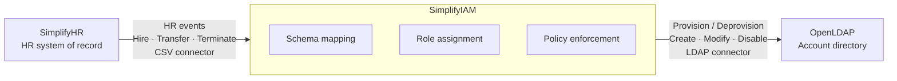

### Saturday 1 - Architecture and Environment
Session date: May 9, 2026

**Architecture Diagram:** 

- **SimplifyHR** fires HR events (hire, transfer, terminate) through an HR connector into SimplifyIAM (Midpoint)
- **SimplifyIAM** is the brain which handles the schema mapping, role assignment, and policy enforcement
- **OpenLDAP** receives the provisioning instructions via an LDAP connector and creates, modifies, or disables accounts accordingly   

**Why This Architecture:** 
- **Why one IGA platform and not a collection of scripts?**

| The Script Approach | The IGA Platform Delivers |
| --------------------- | -------------------------|
| breaks silently in production with no alert | Correlation rules - prevents duplicate identity creation |
| no reconciliation - drift goes undetected | Conflict detection - flags undetected changes in target systems |
| no audit trail - cannot answer 'who did what, when?" | Entitlement governance - tracks every access grant and removal |
| no certification - can not run access reviews | Certification campaigns - periodic access reviews with business sign-off |
| one developer knows how it works. They leave. It Stops. | Audit logs - immutable record of every provisioning action |
 

- **Why OpenLDAP in the lab and not Active Directory?**
OpenLDAP mirrors Active Directory conceptually - same LDAP protocol, same Midpoint connector family. Every concept (dn, ou, cn, objectClass, attributes) learned on OpenLDAP applies directly to Active Directory.  
OpenLDAP (389 DS) is free, open source, runs on Linux. No Windows licence. No domain controller required.

- **Why CSV as the HR source and not a live API?**
CSV export from HR "is a common approach", many organisations run nightly exports from systems like Workday or SAP. Learning CSV-first means learning the dominant real-world pattern. 
CSV file updated by the SimplifyHR Flask app is simple, transparent, debuggable — you can read the source data directly. 
The connector concept is identical. midPoint reads a CSV the same way SailPoint reads a Workday API endpoint. Different connector, same architecture: source → mapping →
target.  

Screenshot: midPoint Screens 
  

Screenshot: SimplifyHR dashboard running 
  

Screenshot: OpenLDAP screens and OU structure 
   

**What I built:** 
- Provisioned a Linux VM in the cloud and installed all three components (HRIS application, MidPoint IGA, and OpenLDAP), each running on their designated ports
- Verified all services were operational via SSH, confirming connectivity and port availability before beginning design work
- Defined the overall IAM architecture covering the Joiner-Mover-Leaver (JML) lifecycle and the identity data flow from HR source (CSV) through MidPoint to the target OpenLDAP directory
- Specified the provisioning approach: CSV connector for HR data ingestion, outbound attribute mappings for account provisioning, and RBAC enforced via MidPoint roles and inducements   
  
**What I learned:** 
During the requirements gathering phase of the project, it is important to be able to extract the right information from the various stakeholders involved.

| Workshop | With Who | What You Are Extracting |
| ---------- | -------- | -----------------------|
| Discovery | CISO / IT Security | Trigger, scope, compliance drivers, budget |
| HR Workshop | HR Team | employee data structure, fields, data quality issues, how often it updates |
| Application Workshop | App Owners | which systems need accounts, what roles exist, who approves access |
| Business Workshop | Department Managers | how do joiners get flagged, who approves movers, what is the leaver process today |
| Audit Workshop | Compliance / Auditors | what evidence is required, retention periods, who needs to sign off access reviews | 
 

**Resume bullet:** Deployed a multi-component IAM environment including midPoint, an HR source simulator, and LDAP directory on a cloud server — verified end-to-end connectivity before first provisioning run  

