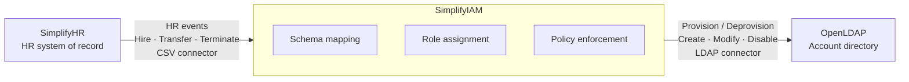

## Week 1 - Architecture and Environment
Session date: May 9, 2026

**What I built:** 
- Defined the overall IAM architecture covering the Joiner-Mover-Leaver (JML) lifecycle and the identity data flow from HR source (CSV) through MidPoint to the target OpenLDAP directory
- Provisioned a Linux VM in the cloud and installed all three components (HRIS application, MidPoint IGA, and OpenLDAP), each running on their designated ports
- Specified the provisioning approach: CSV connector for HR data ingestion, outbound attribute mappings for account provisioning, and RBAC enforced via MidPoint roles and inducements  

**Architecture Diagram:** 

- **SimplifyHR** fires HR events (hire, transfer, terminate) through an HR connector into SimplifyIAM (Midpoint)
- **SimplifyIAM** is the brain which handles the schema mapping, role assignment, and policy enforcement
- **OpenLDAP** receives the provisioning instructions via an LDAP connector and creates, modifies, or disables accounts accordingly  

**Screenshots:**

midPoint Screens 
  

SimplifyHR dashboard running 
  

OpenLDAP screens and OU structure 
   

**Resume bullet:**  Deployed an HRIS system, Midpoint IGA, LDAP directory on a Linux VM in the cloud; tested connectivity between the 3 systems and verified all services are running.

